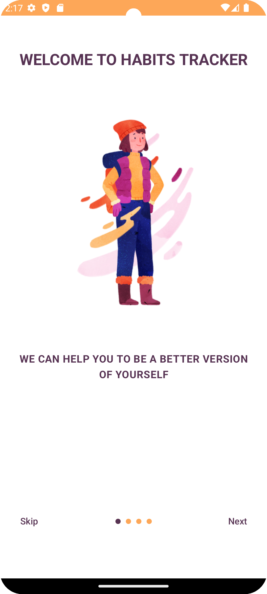
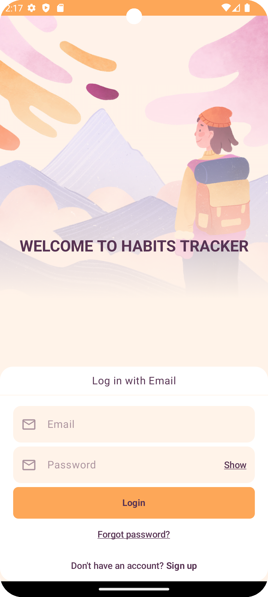
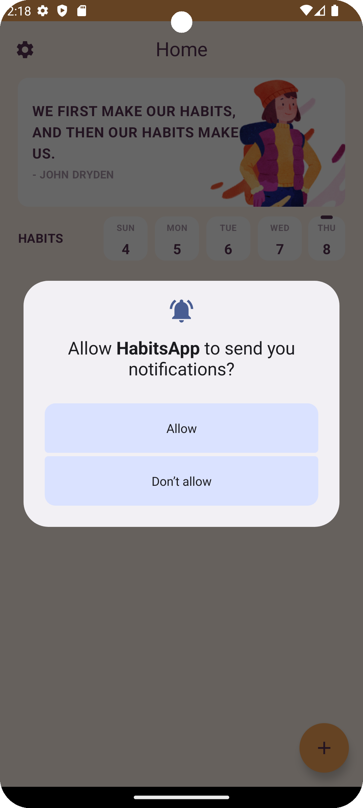
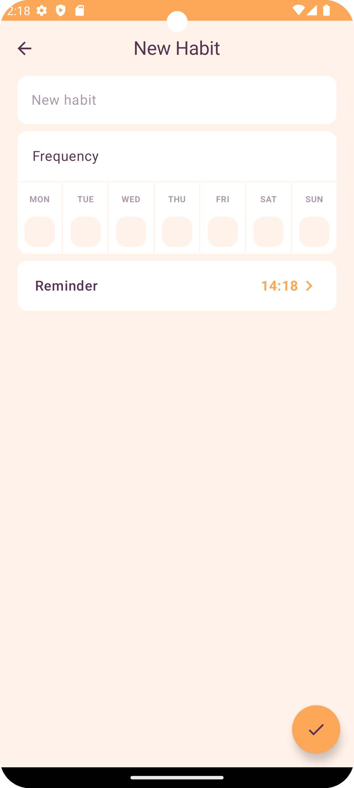

# Habits App

This is an Android application for habit management, developed as part of a course. The app allows users to create, manage, and track their daily habits in a simple and efficient way. It is designed with an "offline-first" approach, ensuring that data is available even without an internet connection.

## Project Objectives

- **Offline-First Approach**: Ensure data is always accessible by storing it locally and synchronizing with the cloud when online.
- **Modern UI**: Leverage Jetpack Compose and Material3 to create an intuitive and visually appealing user interface.
- **Secure Authentication**: Use Firebase Authentication for secure user login and registration.
- **Scalable Architecture**: Implement a clean architecture with MVVM and a feature-layer approach for easy maintenance and scalability.
- **Seamless Synchronization**: Synchronize habit data with a remote server using Retrofit2 for HTTP requests.

## Features

- **Habit Creation and Management**: Create, edit, and delete custom habits with reminders.
- **User Authentication**: Firebase Authentication integration for secure user login and account management.
- **Data Persistence**: Room database ensures offline availability of habit data.
- **Networking**: Retrofit2 handles all HTTP requests for backend synchronization.
- **UI/UX Design**: Modern UI components with Jetpack Compose and Material3.

## Stack

- **Programming Language**: Kotlin
- **UI Framework**: Jetpack Compose
- **Design Framework**: Material3
- **Dependency Injection**: Hilt
- **Local Database**: Room
- **Authentication**: Firebase Authentication
- **Networking**: Retrofit2
- **Architecture**: Clean Architecture + MVVM

## Screenshots

Below are some screenshots of the Habits App:

<p align="center">
  
  
  
  
</p>

## Getting Started

Follow these steps to get a copy of the project up and running on your local machine:

1. **Clone the Repository**:
    ```bash
    git clone https://github.com/ByteSurferX/habits-app.git
    ```
2. **Open the Project**:
    Open the cloned repository in Android Studio.
3. **Firebase Configuration**:
    - Set up Firebase in your project and download the `google-services.json` file.
    - Place the `google-services.json` file in the `app` directory.
4. **Build and Run**:
    Build and run the app on an Android emulator or a physical device.

## Prerequisites

- **Android Studio**: Version Arctic Fox or later.
- **Kotlin**: Version 1.5 or later.
- **Firebase**: Set up a Firebase project for authentication.
- **Basic Android Development Knowledge**: Familiarity with Android development concepts.

## Contributing

Contributions are welcome! If you have suggestions or improvements, please fork the repository and submit a pull request with your changes.

1. Fork the repository.
2. Create your feature branch (`git checkout -b feature/YourFeature`).
3. Commit your changes (`git commit -m 'Add some feature'`).
4. Push to the branch (`git push origin feature/YourFeature`).
5. Open a pull request.

## License

This project is licensed under the MIT License.
